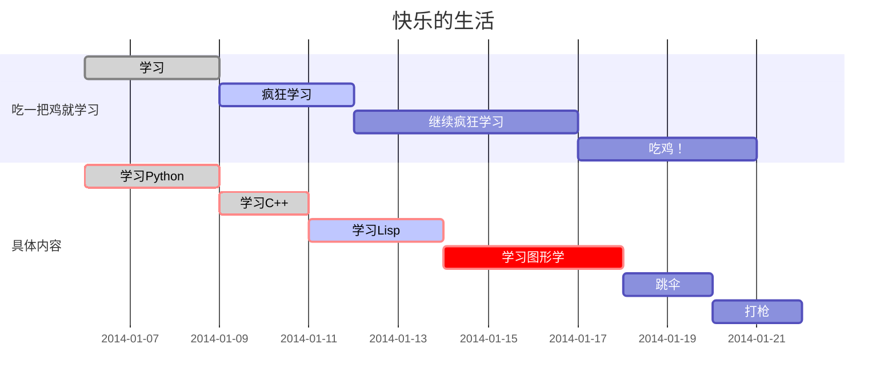

```mermaid
gantt
        dateFormat  YYYY-MM-DD
        title 快乐的生活
        section 吃一把鸡就学习
        学习            :done,    des1, 2014-01-06,2014-01-09
        疯狂学习               :active,  des2, 2014-01-09, 3d
        继续疯狂学习               :         des3, after des2, 5d
        吃鸡！               :         des4, after des3, 4d
        section 具体内容
        学习Python :crit, done, 2014-01-06,72h
        学习C++          :crit, done, after des1, 2d
        学习Lisp             :crit, active, 3d
        学习图形学        :crit, 4d
        跳伞           :2d
        打枪                      :2d
```

# 测试

dadadasdasd
